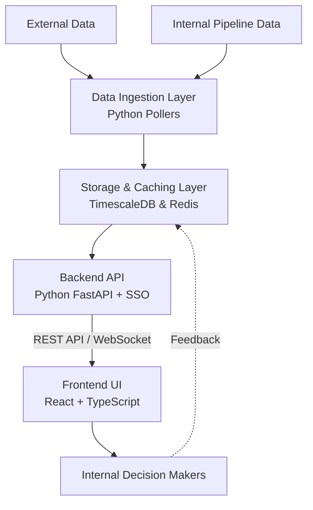

# War Room: Bid Intelligence Dashboard

## Overview
War Room is a self-hosted, web bid intelligence dashboard developed for Prompcorp. 
 
It aggregates tender opportunities from Australian public procurement(AusTenders, NSWeTender) 
 and internal pipeline data to present an interactive operational view for decision makers. 

## Features
- **Tender Ingestion Pipeline**: Automatically fetches data from Australian public sources and internal databases.
- **Interactive Dashboard**: View Active, Upcoming, and Recently Closed bids.
- **Advanced Filtering**: Filter opportunities by sector (facility management, construction, cleaning), state/territory, contract value, and closing date.
- **Secure Access**: Internal access control via Basic authentication or SSO.

## Tech Stack
- **Frontend**: React, TypeScript
- **Backend**: Python(FastAPI)
- **Database & Caching**: PostgreSQL, Timescale extension, Redis
- **Deployment**: Docker, Kubernetes, MicroK8s

## Getting Started
*(Instructions for local Docker setup and MicroK8s deployment will be added here as the infrastructure is finalized.)*

## Acknowledgments & Licenses
This project is built upon the open-source foundations of:
- [Sovereign_watch](https://github.com/d3mocide/Sovereign_Watch)
- [worldmonitor](https://github.com/koala73/worldmonitor)